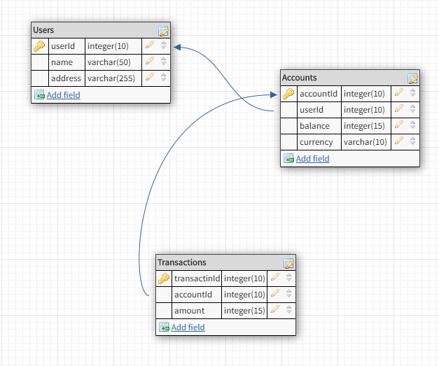

1. Написать sql скрипт для создания базы даннх со следующей структурой

sql скрипт:

`CREATE TABLE Users (
userId  INTEGER    PRIMARY KEY
UNIQUE
NOT NULL,
name    TEXT (50)  NOT NULL,
address TEXT (255)
);`

`CREATE TABLE Accounts (
accountId INTEGER      PRIMARY KEY,
userId    INTEGER (10) REFERENCES Users (userId) ON DELETE CASCADE
MATCH SIMPLE
NOT NULL,
balance   INTEGER (15),
currency  TEXT (10),
FOREIGN KEY (
userId
)
REFERENCES Users (userId) ON DELETE SET NULL
ON UPDATE SET NULL
MATCH SIMPLE
);`

`CREATE TABLE Transactions (
transacId INTEGER      PRIMARY KEY
NOT NULL,
accountId INTEGER (10) NOT NULL
REFERENCES Accounts (accountId) ON DELETE CASCADE
MATCH SIMPLE,
amount    INTEGER (15),
FOREIGN KEY (
accountId
)
REFERENCES Accounts (accountId)
);`

Написать программу на Java, предоставляющую следующую функциональность:
   
*         a)	Регистрацию нового пользователя
 *        b)	Добавление аккаунта новому пользователю
 *        c)	Пополнение существующего аккаунта
  *       d)	Снятие средств с существующего аккаунта.
Ограничения: 
*          a)	Каждый пользователь может иметь сколько угодно аккаунтов в разных валютах
*          b)	Пользователь может иметь только 1 аккаунт в конкретной валюте
*          c)	Размер транзакции не может превышать 100’000’000
*          d)	Баланс аккаунта не может быть отрицательным или превышать 2’000’000’000
*          e)	Поле адрес является необязательном к заполнению при регистрации